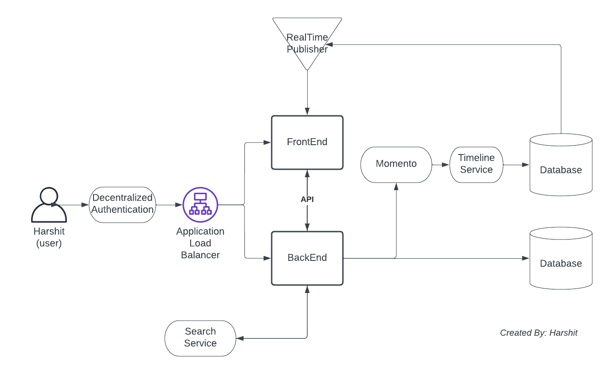
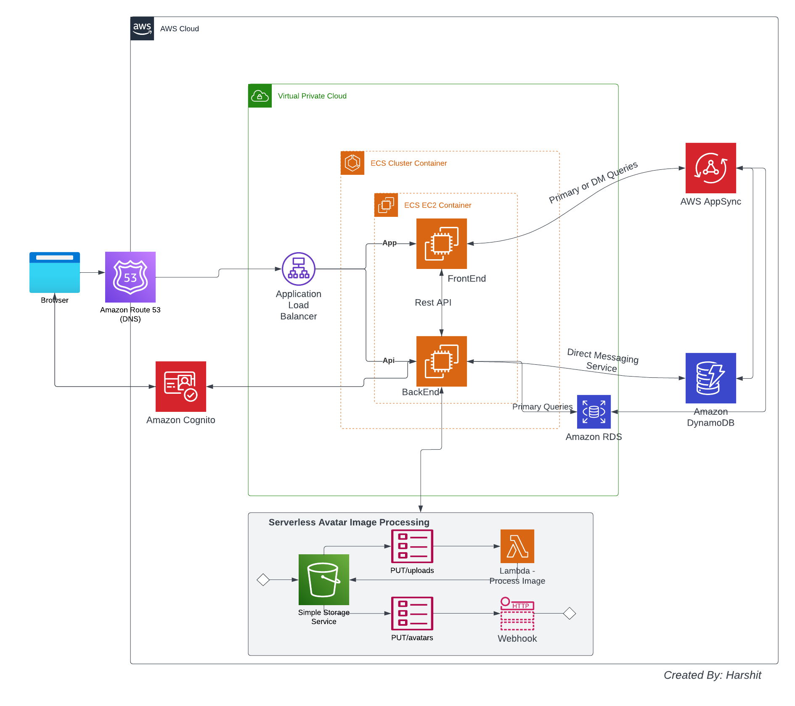

# Week 0 — Billing and Architecture

## Prerequisites
* Created AWS Account and "aws-bootcamp-crudder-2023" repo for Bootcamp.
* Set up Gitpod account and browser extension authorized with Github.
* Created LucidCharts Account to build Architectural diagrams.
* Created HoneyComb Account for distributed tracing.
* Created Rollbar Account for Bug Tracing.

## Required Homework/Tasks

### Install AWS CLI and ensure that it works
View the [GitPod Yaml](https://github.com/ht3886/aws-bootcamp-cruddur-2023/blob/main/.gitpod.yml) file on main branch.

### Created A Billing Alarm (via AWS CLI)
View the [Alarm Config](https://github.com/ht3886/aws-bootcamp-cruddur-2023/blob/main/aws/json/alarm-config.json) file on main branch.

### Create A Budget (via AWS CLI)
View the [Budget](https://github.com/ht3886/aws-bootcamp-cruddur-2023/blob/main/aws/json/budget.json) and [Budget Notification - SNS](https://github.com/ht3886/aws-bootcamp-cruddur-2023/blob/main/aws/json/budget.json) files on main branch.

### Recreate Conceptual Diagram in LucidCharts (Napkin Design)

[Lucid Chart - Napkin Diagram](https://lucid.app/lucidchart/012e1ff8-c184-4e8f-a4eb-a5399181951d/edit?invitationId=inv_a730fe03-60b4-4552-92be-e0bf88949ab4)

### Finished Architectural Diagram in LucidCharts

[Lucid Chart - Arch. Diagram](https://lucid.app/lucidchart/e97b10ed-e6f0-4443-8833-4b8a19bbdb64/edit?invitationId=inv_217f451f-bd78-4d7b-bc47-f1efb615cdd2)
