# Week 2 — Distributed Tracing

## Tasks completed during live-stream class
* Installed Honeycomb and dependencies
* Setup data transfer for Honeycomb
* Confirmed trace data is showing up in the Honeycomb Web UI

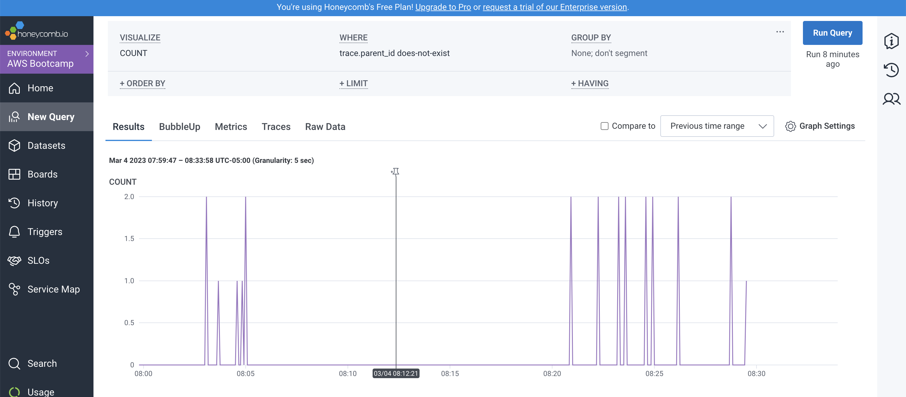

## Required Homework/Tasks

### AWS X-Ray
New Sampling rule - Crudder
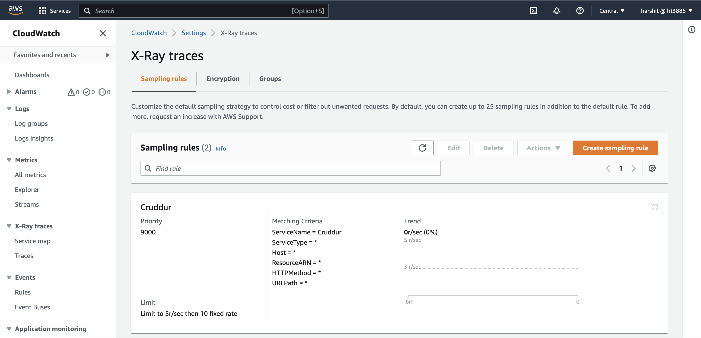

New Sampling group - Crudder
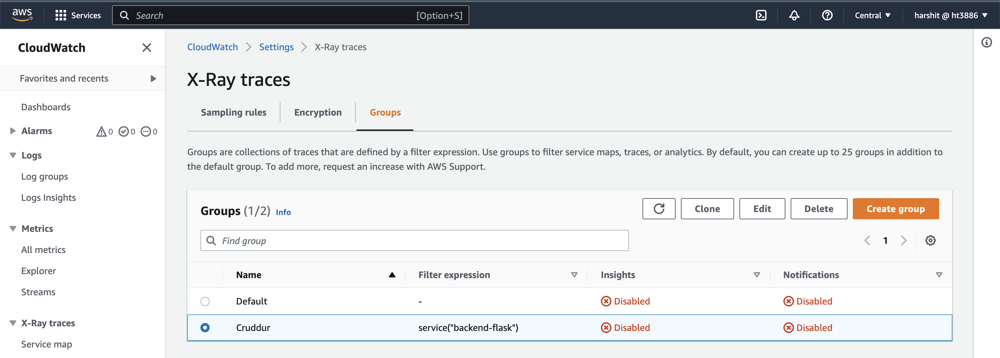

Data traces received in X-Ray
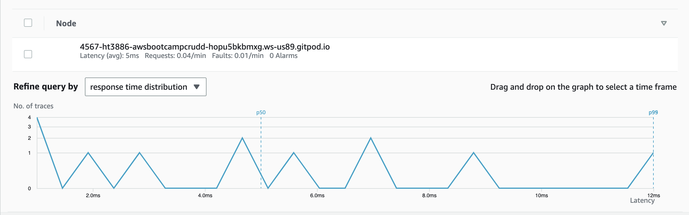

List of Traces in X-Ray
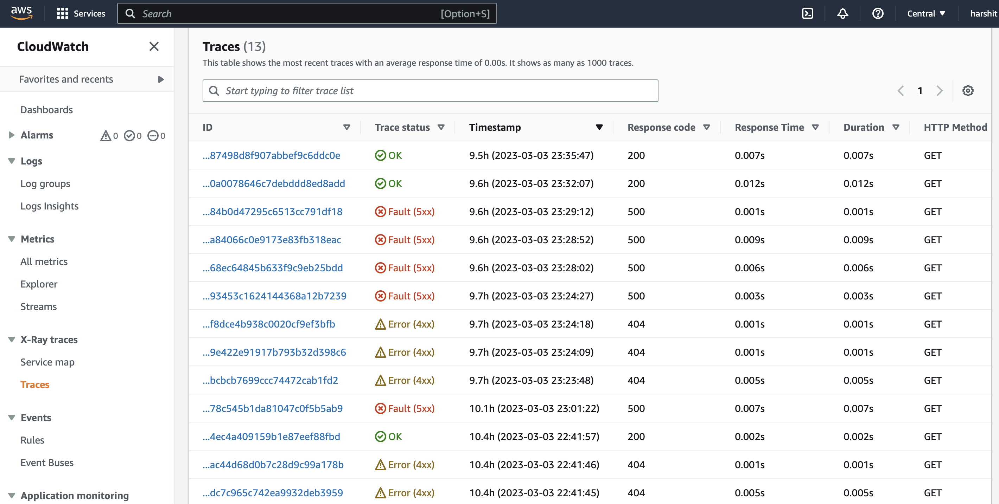

Trace segment timeline
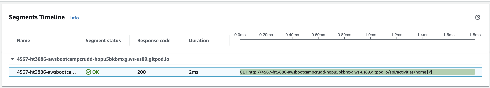

### CloudWatch
Log data in API Endpoint
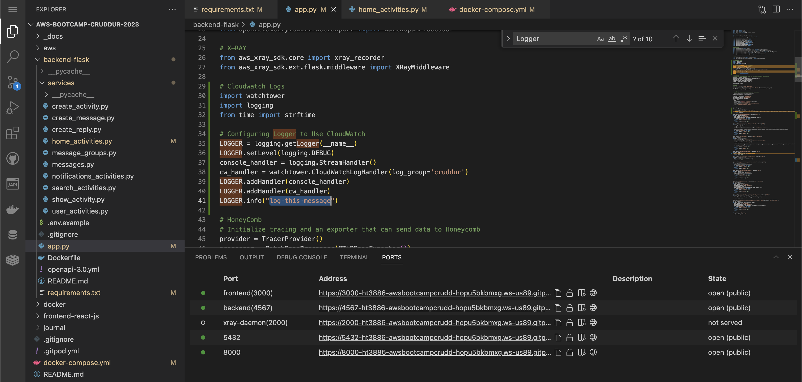

Log data received in CW Logs - AWS console
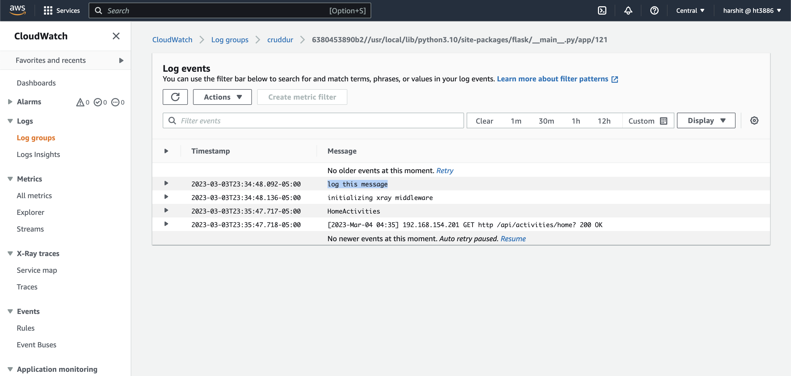

### Rollbar
Rollbar endpoint for testing Rollbar
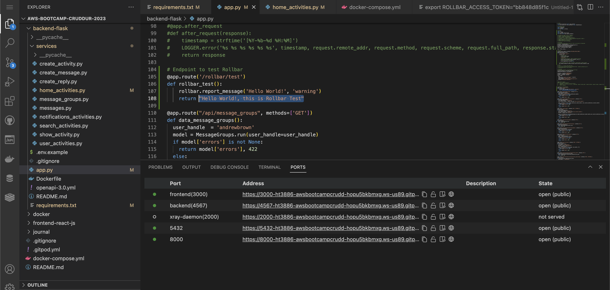

Rollbar Endpoint in server
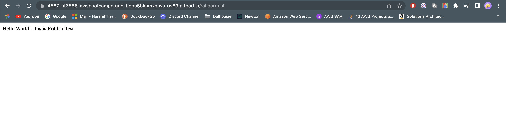

Warning and Error data received in Rollbar
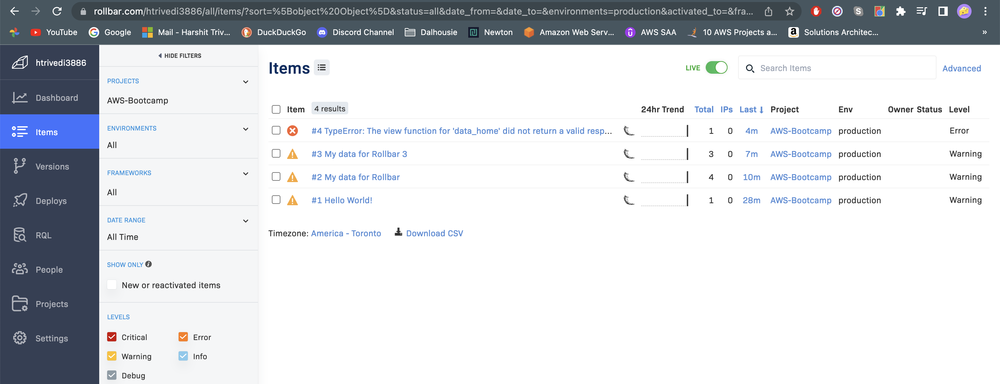
