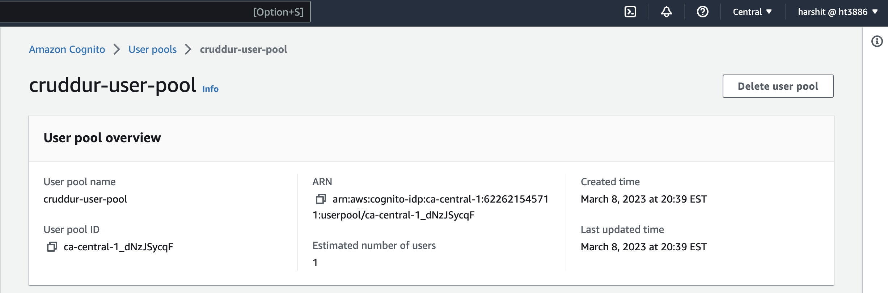
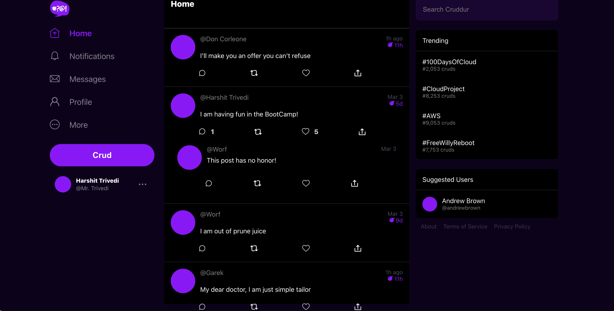
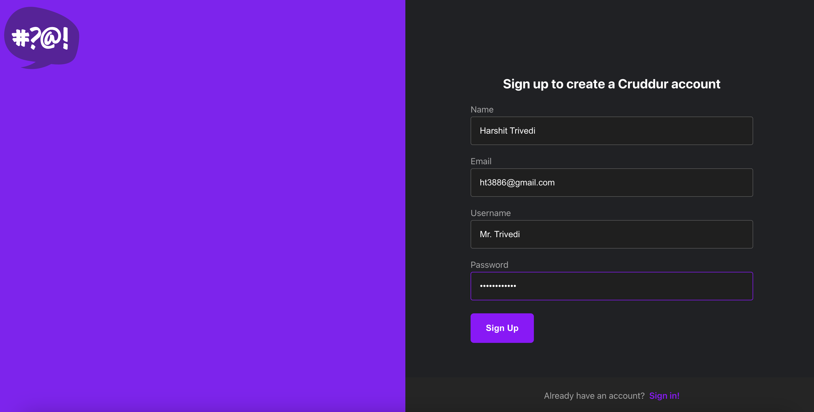
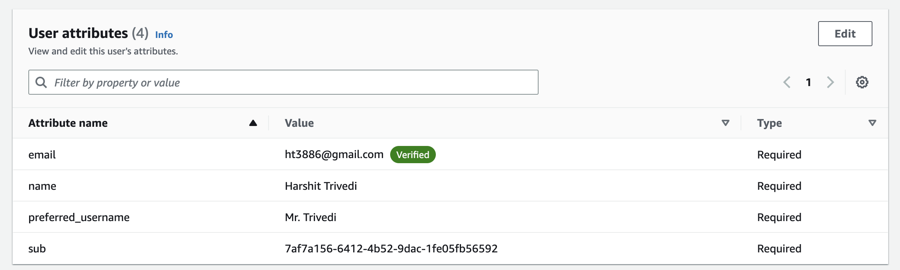
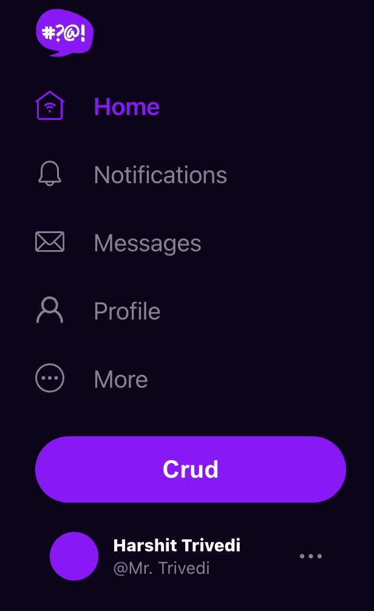
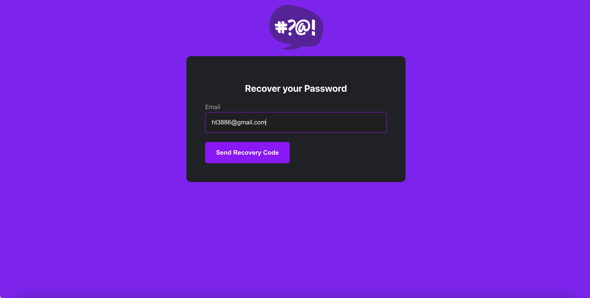
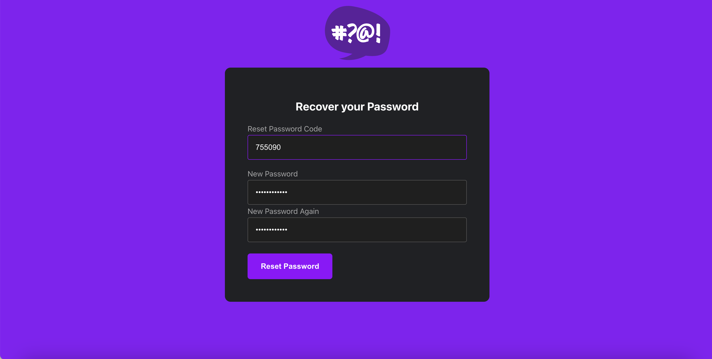
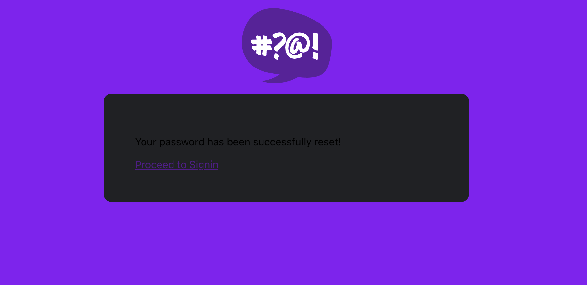

# Week 3 — Decentralized Authentication

## Tasks completed during live-stream class:
* Created new Cognito User Pool in AWS.
* Install AWS-amplify and setup Environment Variables for cognito region, user pools and client-id.
* Customize HomeFeedPage, SignInPage, and ProfileInfo page based on authenticated user.
* Registered and confirmed creating a new user from cli.

#### Cognito User pool

#### Newly created user

## Required Homework/Tasks

### SignUp as a new user

### User verified - reflected in Cognito

### Signed-in user

### Name and preffered name - Cognito

### Recover/Reset Password

### Implement backend token check
