# Week 4 — Postgres and RDS

## Tasks completed during live-stream class:
* Provision RDS Instance using AWS CLI.
* Configure and connect to PostgreSQL RDS database.
* Configure Database Schema.
* Implement bash scripts for DB connect, DB create, DB drop, DB seed and DB schema-load.
* Insert tables in the localhost PostgreSQL DB.

#### Create and connect to DB (localhost)
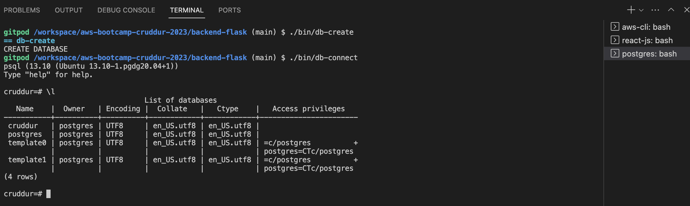

#### Load schema in DB (localhost)
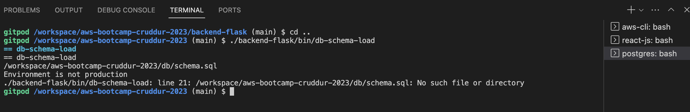

#### Drop DB (localhost)
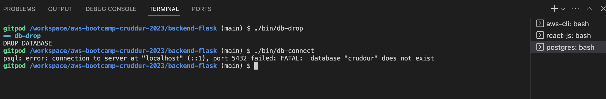

#### _chmod_ bash command
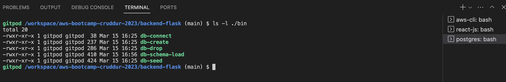

#### Schema load and List tables in local cruddur DB
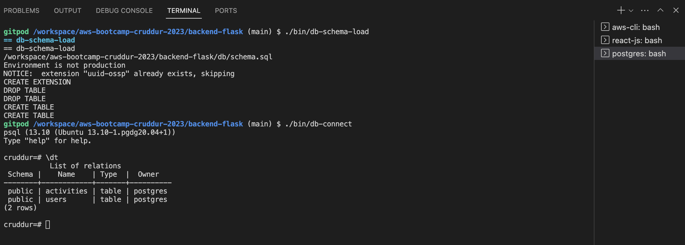

#### _seed_ data in local DB
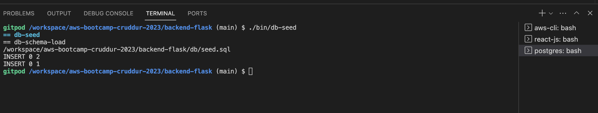

#### data inserted in "users" table (local DB)
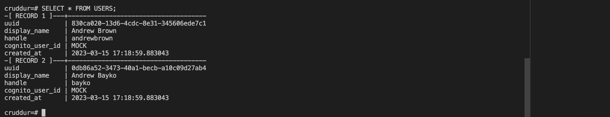

#### data inserted in "activities" table (local DB)
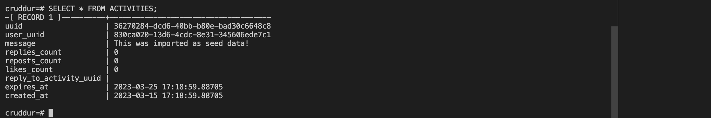

## Required Homework/Tasks

### configure _db-setup_ bash script (local DB)
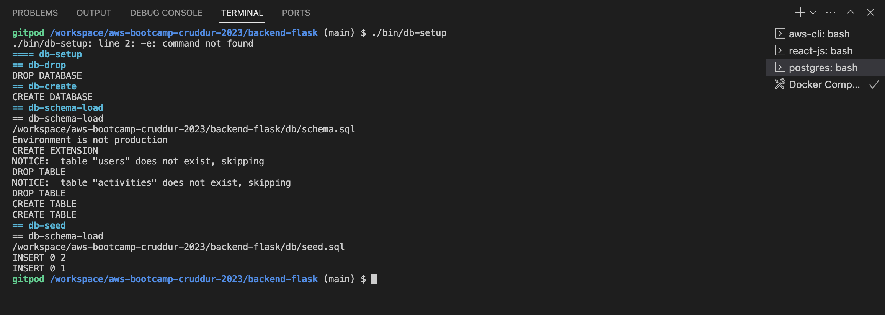

### view current-db sessions
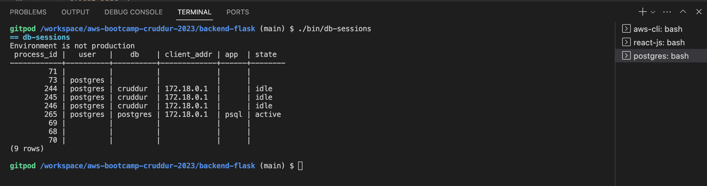

### seed-data-locally (join query)
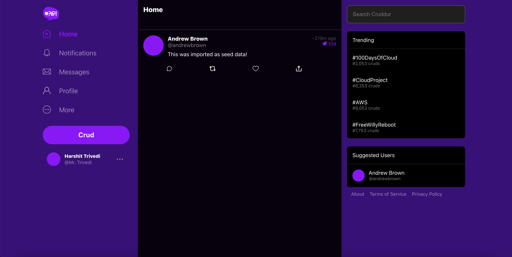

### Connect to PROD DB (RDS instance - AWS)
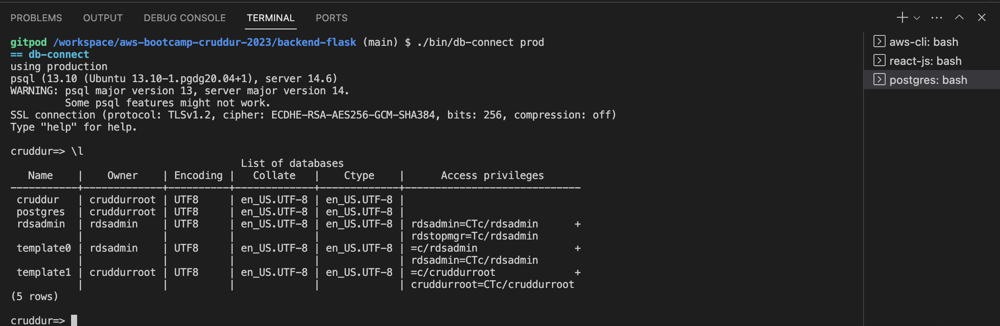

### Modify RDS instance's security group dynamically everytime we start a GitPOD session
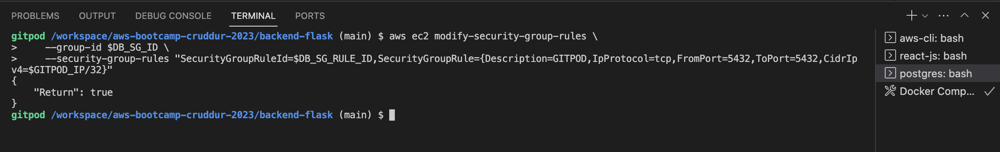

### SG Inbound rule updated dynamically - AWS
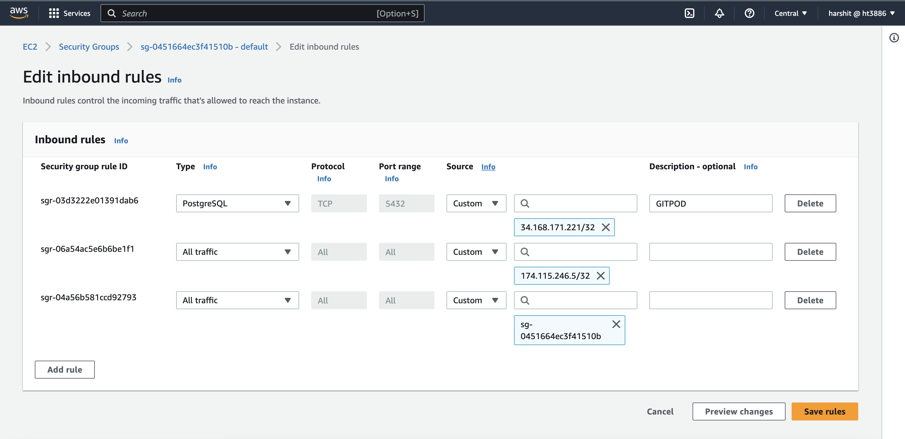

### Create tables in PROD DB
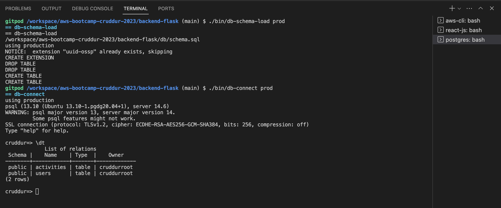

### Sign up a new user
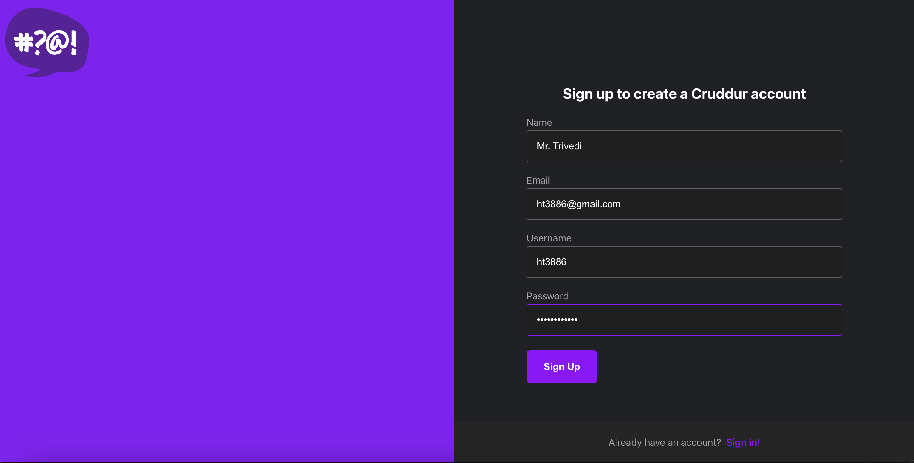

### Input confirmation code received in email
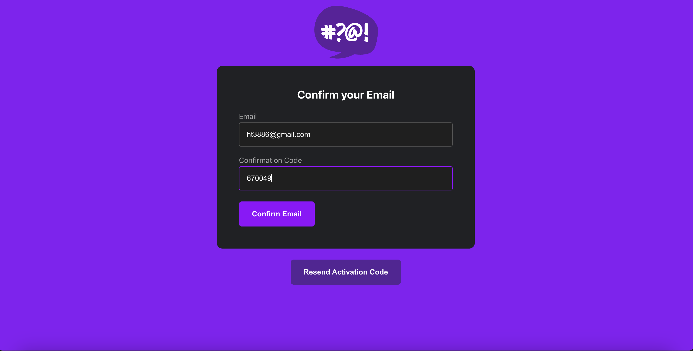

### Create and deploy Lambda function
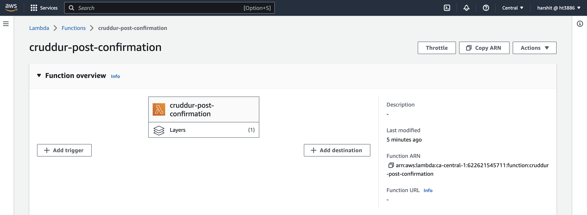

### Newly created user inserted in _users_ table - PROD DB
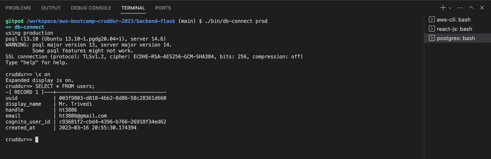

### Implemented create activities feature
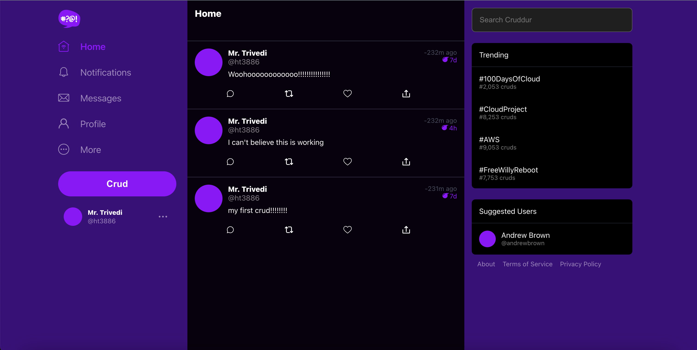

### CRUD inserted in _activities_ table - PROD DB
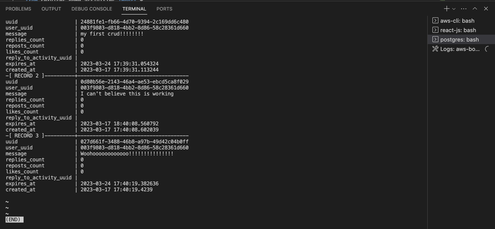

## Refrences

https://github.com/omenking/aws-bootcamp-cruddur-2023/blob/week-4/journal/week4.md

https://www.postgresql.org/docs/current/app-createdb.html

https://aviyadav231.medium.com/automatically-updating-a-timestamp-column-in-postgresql-using-triggers-98766e3b47a0

https://askubuntu.com/questions/595269/use-sed-on-a-string-variable-rather-than-a-file

https://stackoverflow.com/questions/5947742/how-to-change-the-output-color-of-echo-in-linux

https://www.psycopg.org/psycopg3/

https://docs.aws.amazon.com/cli/latest/reference/ec2/modify-security-group-rules.html#examples
