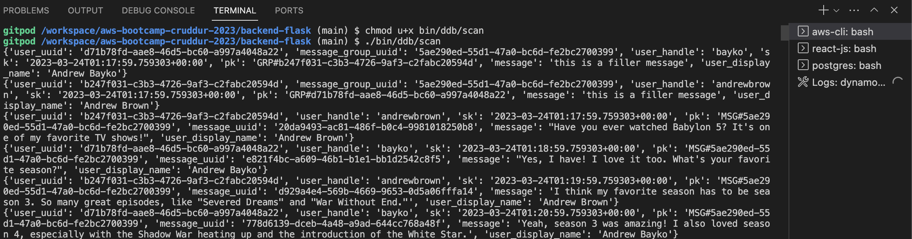

# Week 5 — DynamoDB and Serverless Caching

## Required Homework:

#### Creat a new DynamoDB table - locally

#### Bash script to scan locally inserted data

#### DynamoDB access pattern - to get-conversations locally

#### DynamoDB access pattern - to list-conversations locally

#### List users inserted in AWS Cognito user pool

#### Update used-id for the cognito user

#### Cognito user ID now updated for my user in the local DB

#### Implement Access Pattern A - Listing Messages in Message Group into Application (other's user's handle in URL)

### Implement Access Pattern A - Listing Messages in Message Group into Application (other's user's uuid in URL)

### Implement Access Pattern B - Listing Message Group into Application

### Seed Conversations into DynamoDB

### Implement Access Pattern C - Creating a Message for an existing Message Group into Application

### Insert new user (Londo) into DB - locally

### Implement Access Pattern D - Creating a Message for a new Message Group into Application 

### Create a new DynamoDB table in AWS using cli

### Newly created table reflected in AWS console 

### Send message to used to test DynamoDB streams

### Implemented Access Patter E - Updating a Message Group using DynamoDB Streams

