# Week 6 — Deploying Containers

# 

## Homework Task Screenshots

#### Create a new ECR Repository named "cruddur-python" using AWS CLI

#### Login to ECR

#### Map cruddur ECR Python URL

#### Pull python3.10 image from Docker

#### python3.10 image pushed in AWS

#### Container running locally - pulled from ECR

#### Create execution role for Task Definition

#### Set SSM parameters

#### Create CruddurTaskRole in IAM and attach required policies

#### Task Definition for Backend

#### Map default VPC and create security group for container

#### Install Session Manager plugin

#### Backend container service started successfully

#### Task running for backend service and Health Check passed

#### Bash into ECS container

#### HealthCheck working for cruddur service

#### Security Group modified - It now allows cruddur service to connect to RDS data

#### Load Balancer to container service

#### ALB running healthy

#### Create frontend repo and set env vars

#### Shell into FrontEnd Container

#### Cruddur FrontEnd Target Group registered and is Healthy
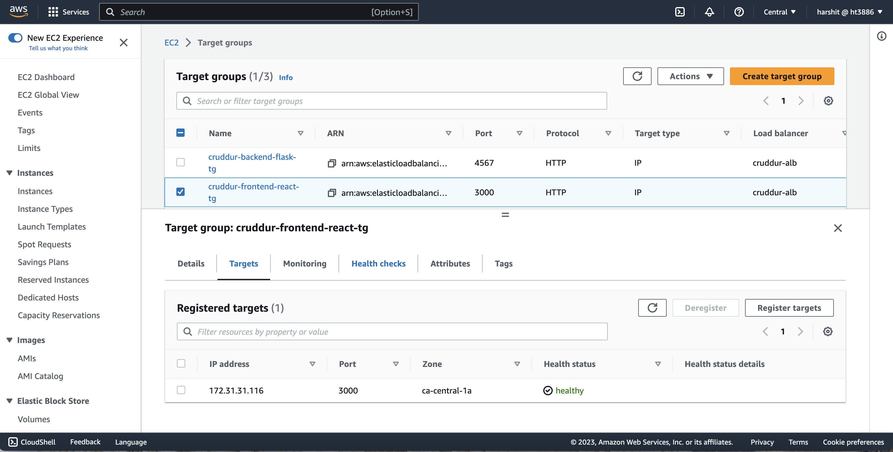

#### Cruddur (FrontEnd) website now running and loading data on HomeFeed
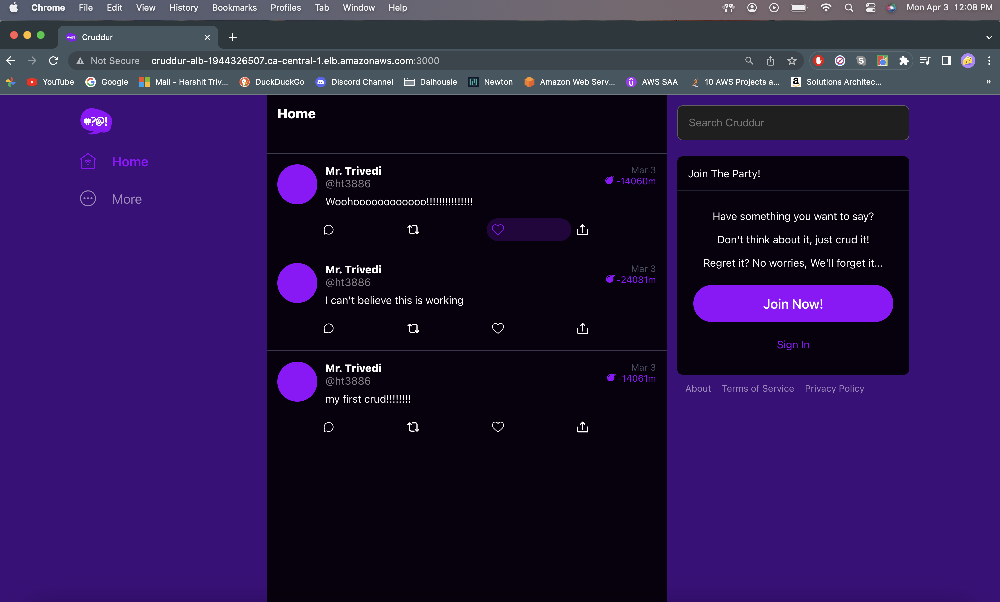

#### Purchase a new domain "mr-trivedi.click" from Route53
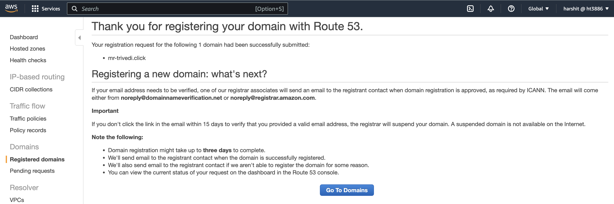

#### Request Public certificate from ACM
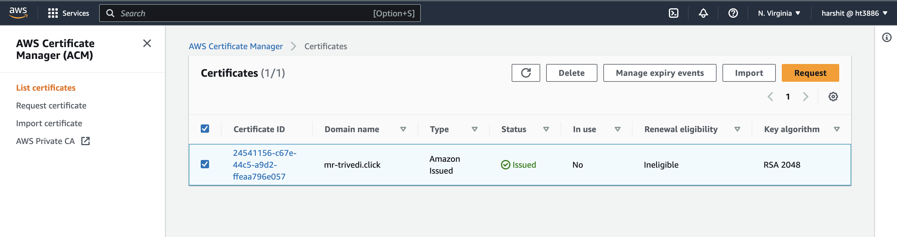

#### Update rules on ALB-listener on port-443
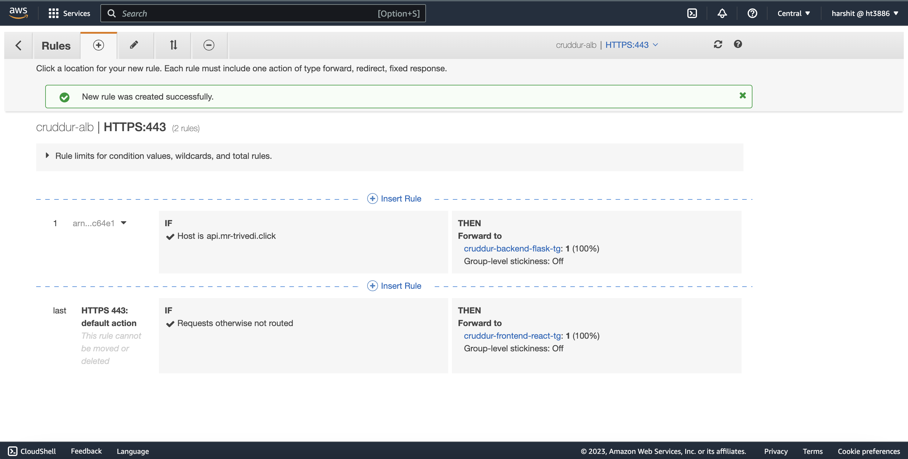

#### Create A type record in route53 for frontend - https://mr-trivedi.click 
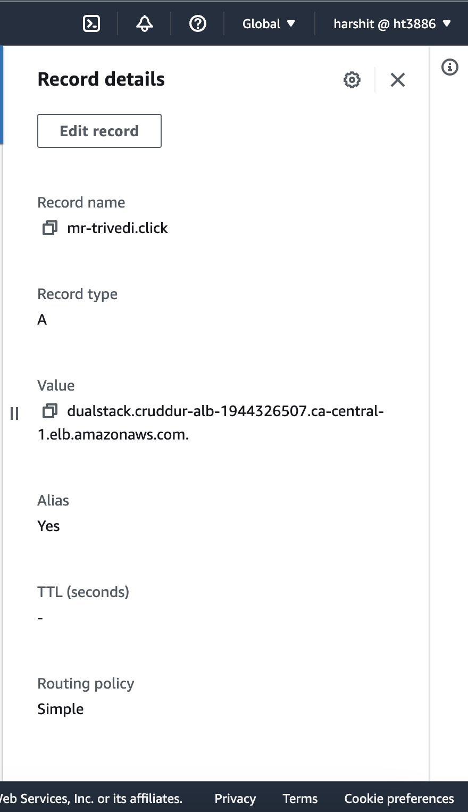

#### Create another A type record in route53 for backend - https://api.mr-trivedi.click 
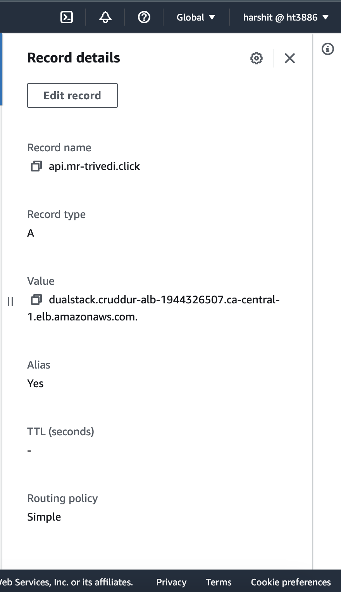

#### FrontEnd successfully deployed on my domain
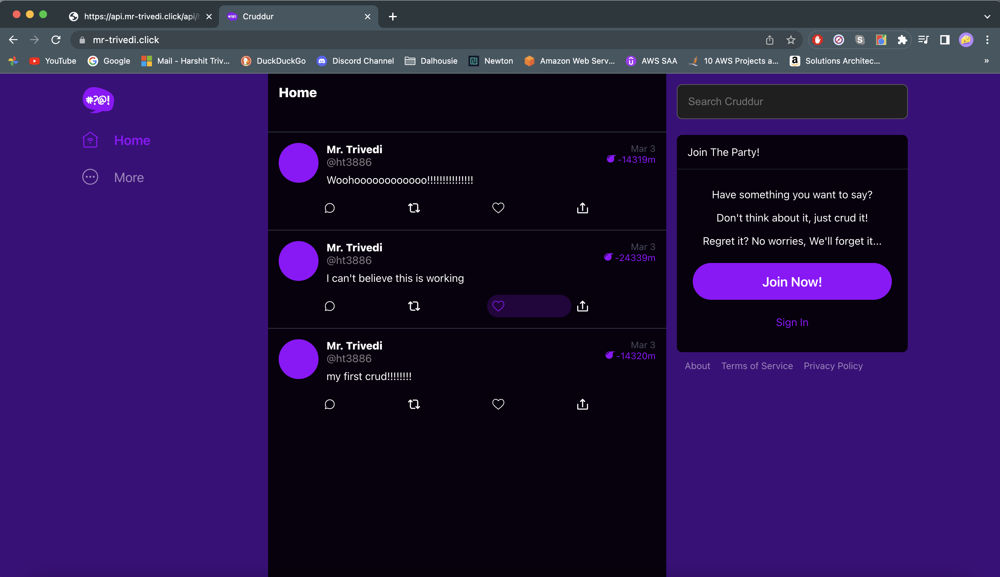

#### BackEnd successfully deployed on my domain
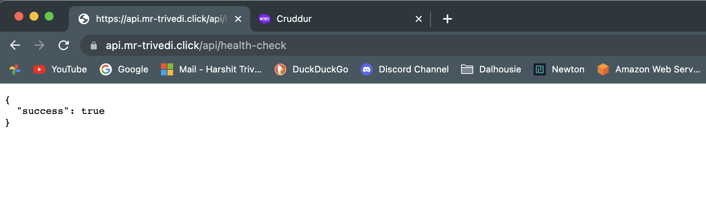

#### Post messages to another user - Bayko
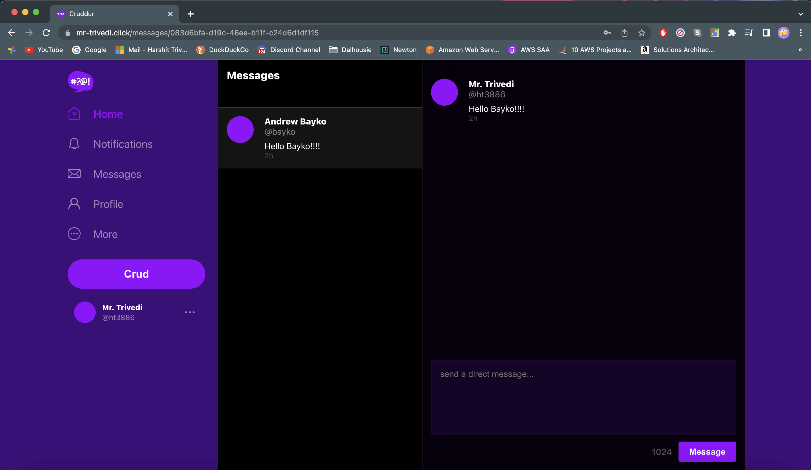

#### Create my own network - 'cruddur-net'
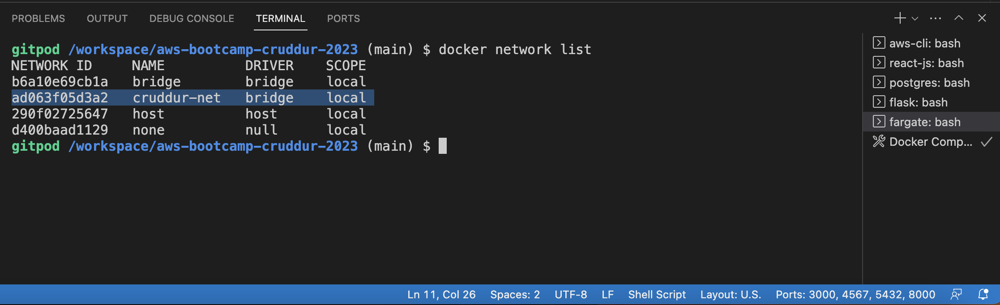

#### Implement Busybox
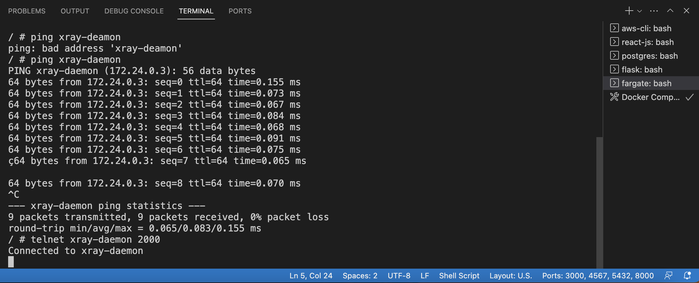

#### Timezone fix implemented in HomeFeedPage
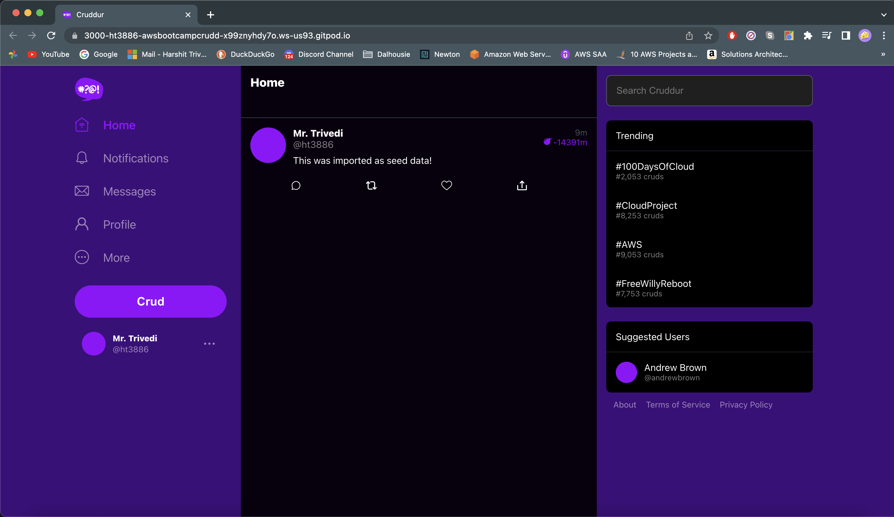

#### Timezone fix implemented in Messages
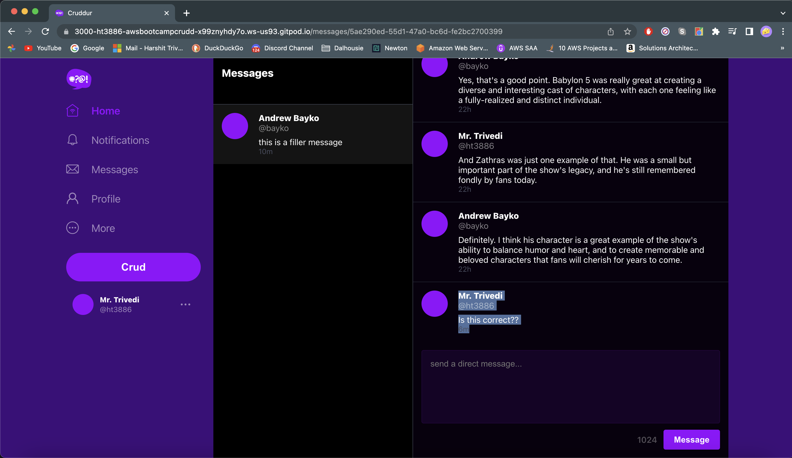
