# Week 6 — Deploying Containers

# 

## Homework Task Screenshots

#### Create a new ECR Repository named "cruddur-python" using AWS CLI
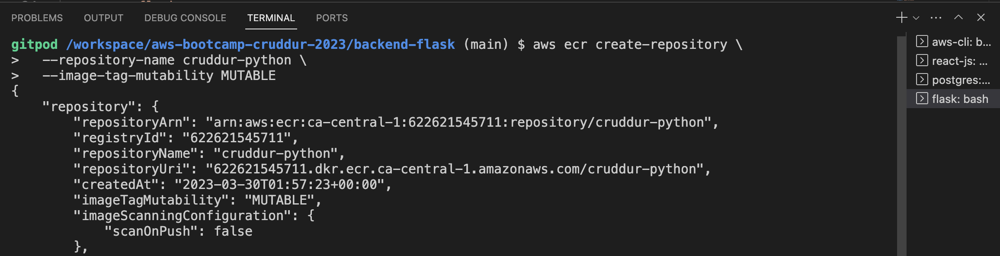

#### Login to ECR
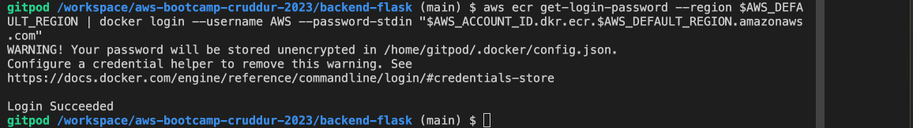

#### Map cruddur ECR Python URL
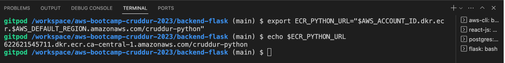

#### Pull python3.10 image from Docker
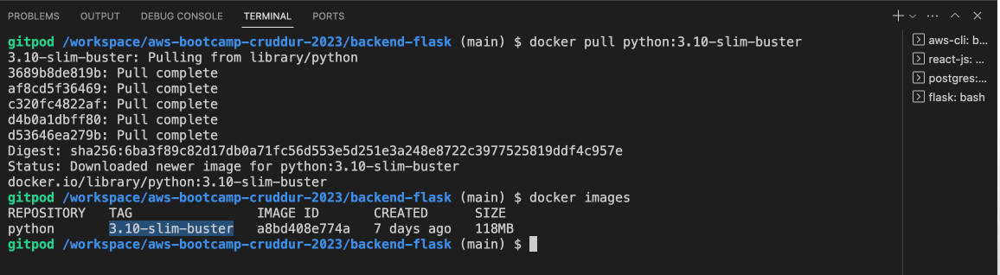

#### python3.10 image pushed in AWS
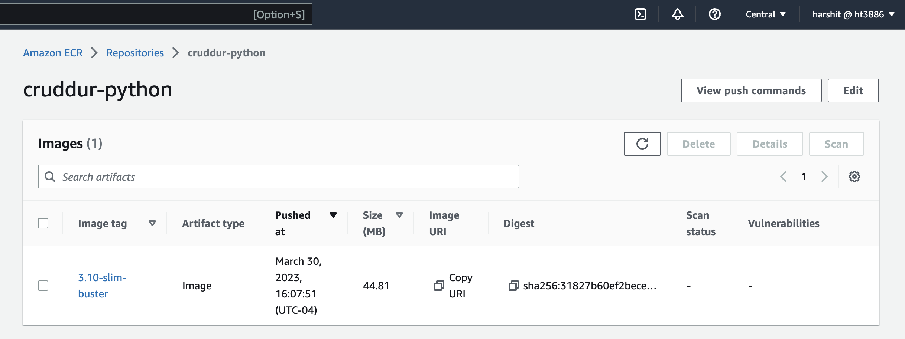

#### Container running locally - pulled from ECR
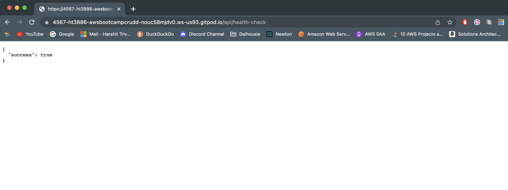

#### Create execution role for Task Definition
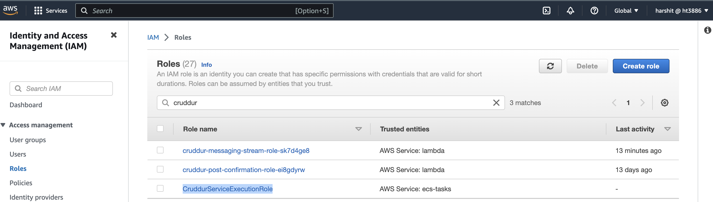

#### Set SSM parameters
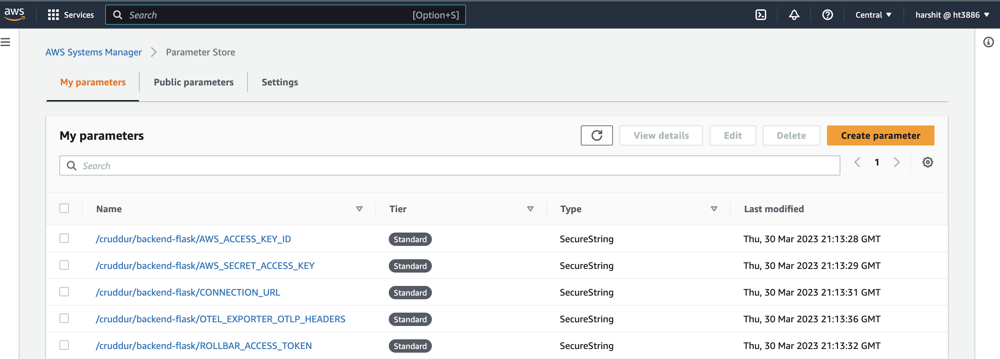

#### Create CruddurTaskRole in IAM and attach required policies
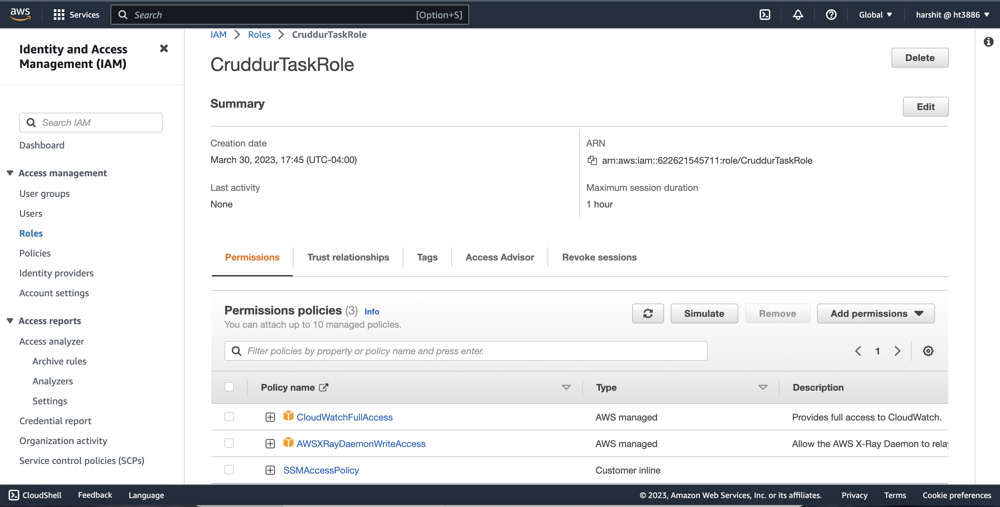

#### Task Definition for Backend
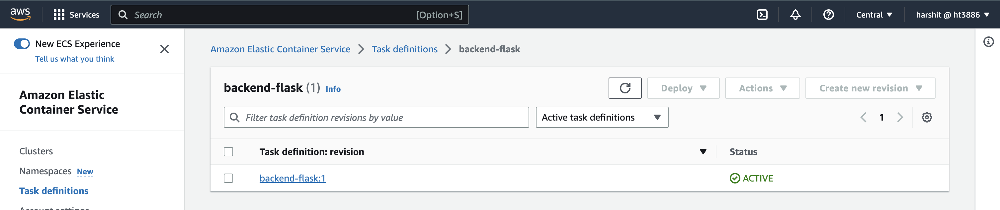

#### Map default VPC and create security group for container
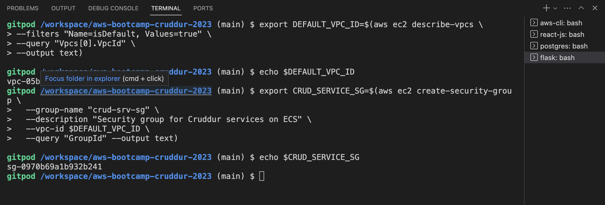

#### Install Session Manager plugin
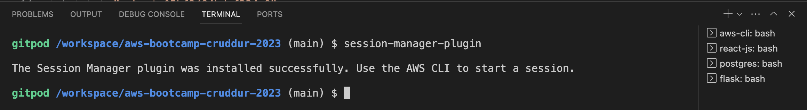

#### Backend container service started successfully
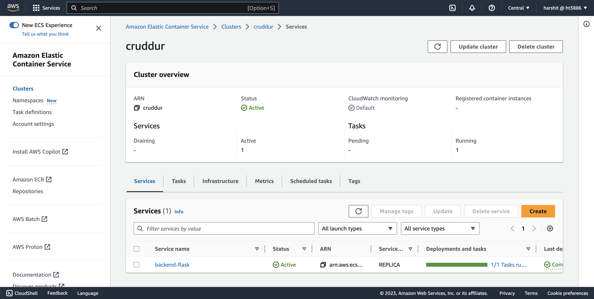

#### Task running for backend service and Health Check passed
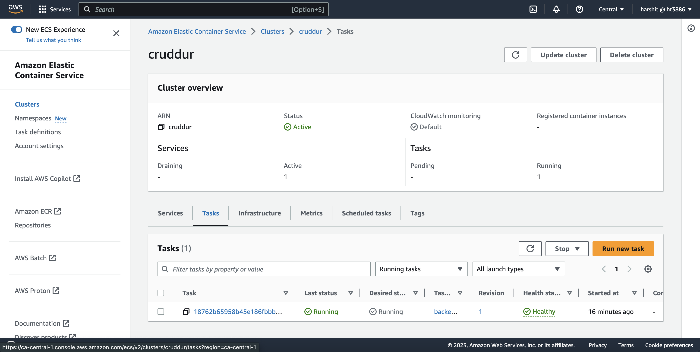

#### Bash into ECS container
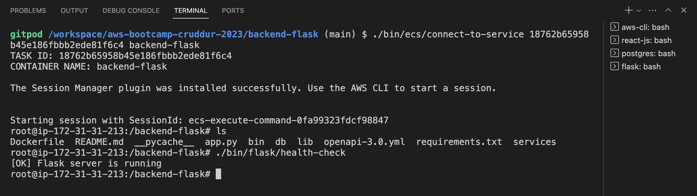

#### HealthCheck working for cruddur service
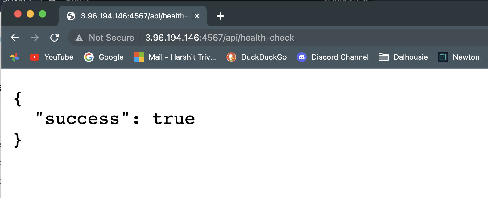

#### Security Group modified - It now allows cruddur service to connect to RDS data
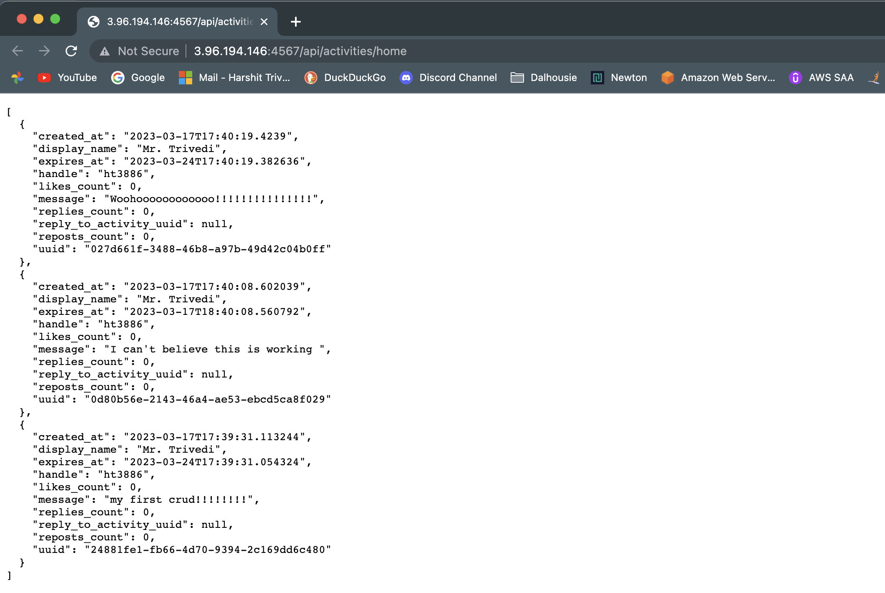

#### Load Balancer to container service
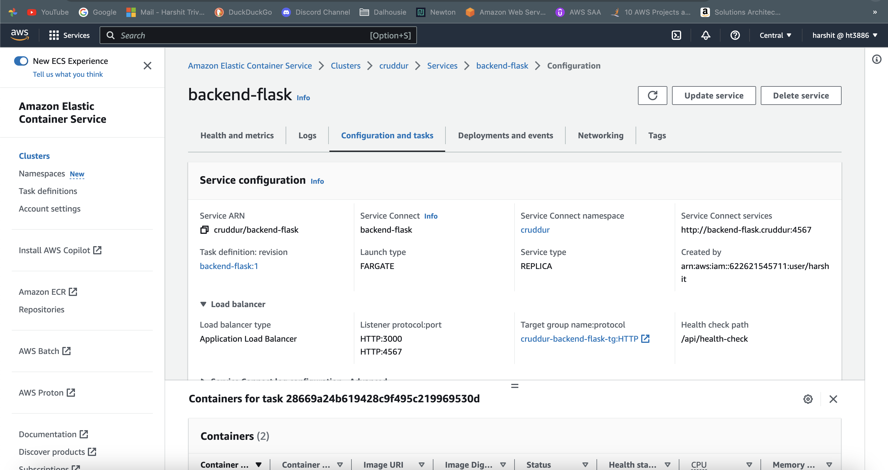

#### ALB running healthy
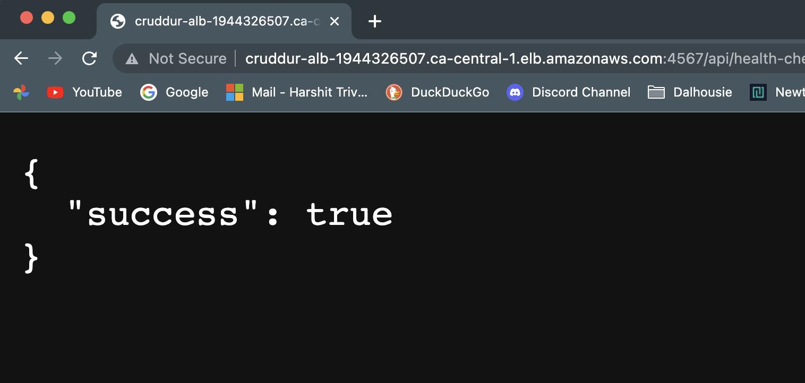

#### Create frontend repo and set env vars
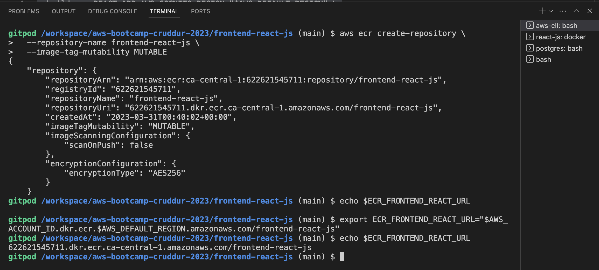

#### Docker image is pushed and frontend is not
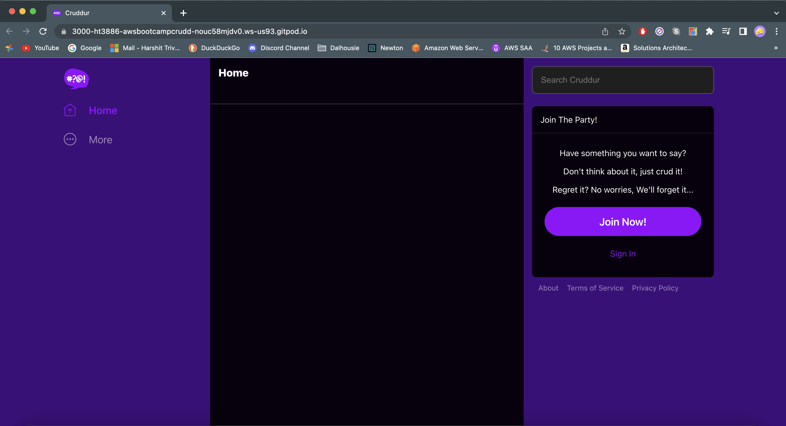

#### 

