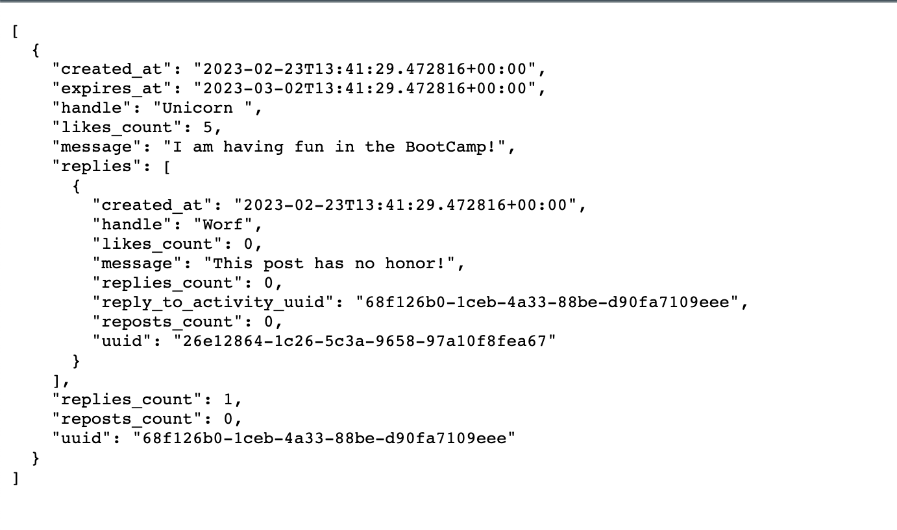
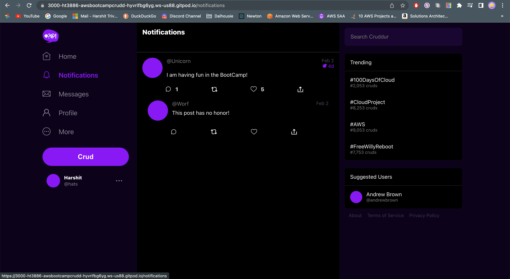
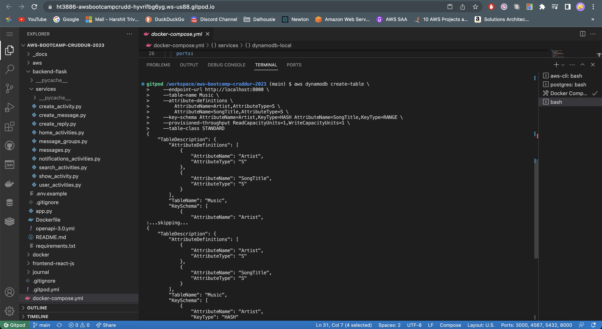
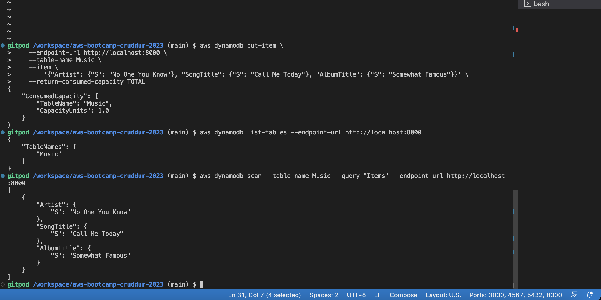
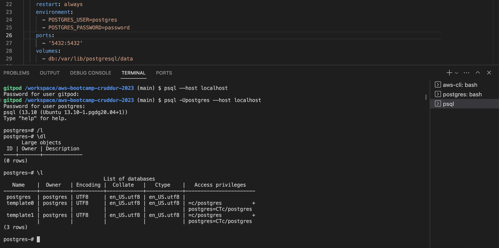
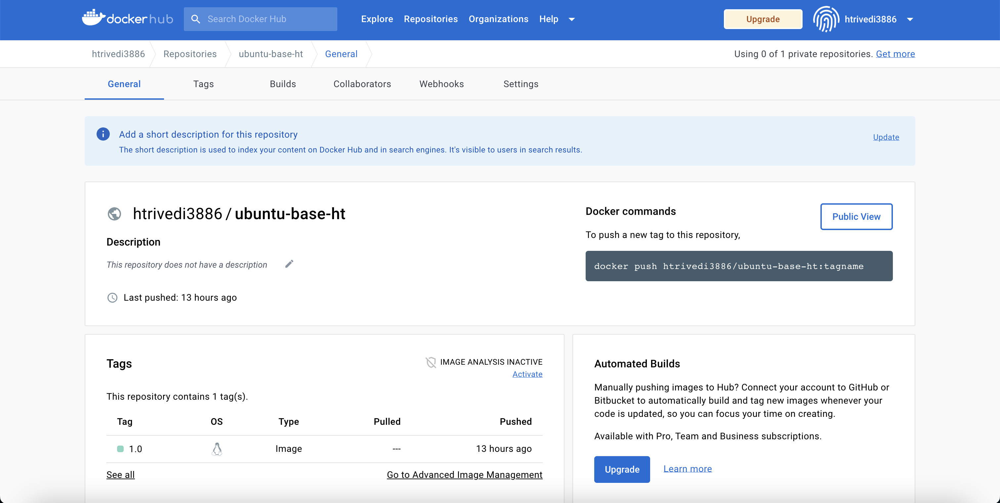
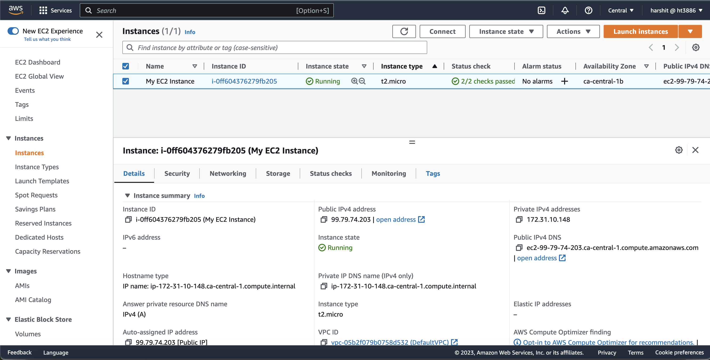
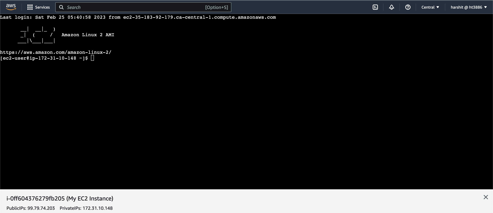
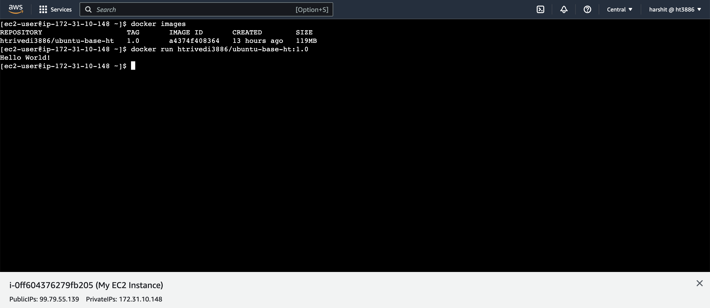

# Week 1 — App Containerization


## Tasks completed during live-stream class
* Install Python 3
* Create Docker files for [FrontEnd](https://github.com/ht3886/aws-bootcamp-cruddur-2023/blob/main/frontend-react-js/Dockerfile) and [Backend](https://github.com/ht3886/aws-bootcamp-cruddur-2023/blob/main/backend-flask/Dockerfile)
* Built and Run Containers
* Create a [Docker Compose](https://github.com/ht3886/aws-bootcamp-cruddur-2023/blob/main/docker-compose.yml) file.


## Required Homework/Tasks

### Document the Notification Endpoint for the OpenAI Document 
[OpenAPI](https://github.com/ht3886/aws-bootcamp-cruddur-2023/blob/main/backend-flask/openapi-3.0.yml#L151)

### Write a Flask Backend Endpoint for Notifications



### Write a React Page for Notifications


### Run DynamoDB Local Container and ensure it works
Create DynamoDB Table


Insert, List and Select rows from table


### Run Postgres Container and ensure it works


## Homework challenge

### Push and tag a image to DockerHub

1. Create DockerFile

2. Build the dockerimage

```
docker build -t ubuntu-base-ht:1.0 . 
```

3. Verify image was built successfully

```
docker images
```

4. Created a account on dockerhub.com

5. Go back to terminal, login to dockerhub and push the image
```
docker login
Enter username and password
```

6. Tag the image to push it to my repository: htrivedi3886
```
docker tag ubuntu-base-ht:1.0 htrivedi3886/ubuntu-base-ht:1.0
docker push htrivedi3886/ubuntu-base-ht:1.0
```

Voila! Your image is pushed to dockerhub.com



### Launch an EC2 instance that has docker installed, and pull a container to demonstrate you can run your own docker processes

1. Launch an instance (My EC2 Instance) with the Amazon Linux 2 AMI


2. Connect to it using EC2 Instance Connect


3. Update the installed packages and package cache on your instance
```
sudo yum update -y
```

4. Install the latest Docker Engine package
```
sudo amazon-linux-extras install docker
```

5. Start Docker service and add permission to execute Docker commands without sudo
```
sudo service docker start
sudo usermod -a -G docker ec2-user
```

6. Pull the Docker Image from DockerHub
```
docker pull htrivedi3886/ubuntu-base-ht:1.0
```

7. List available Docker images
```
docker images
```

8. Run the Docker image
```
docker run htrivedi3886/ubuntu-base-ht:1.0
```


## References

https://docs.docker.com/engine/reference/commandline/build/

https://docs.aws.amazon.com/AmazonECS/latest/developerguide/create-container-image.html
